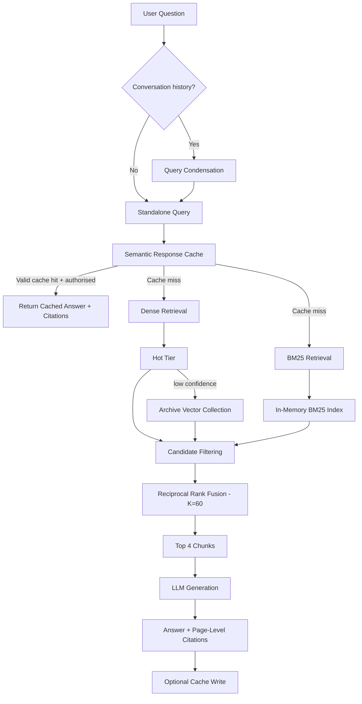

# Citation-Grounded Retrieval System for University Regulations

An MSc Computer Science project that investigates how **hybrid retrieval, citation grounding, conversational query rewriting, and retrieval-time access control** can improve question answering over university regulations.

The system was developed using the University of Birmingham Computer Science Student Handbook as the primary retrieval corpus.

## Overview

General-purpose LLMs can produce fluent answers, but institution-specific policy questions introduce additional requirements: answers should be grounded in authoritative documents; exact policy terms and acronyms should be retrieved reliably; users should be able to verify answers against source pages; restricted material should be filtered before generation; follow-up questions should retain context; and cached answers should not outlive the source policy on which they depend.

This project addresses those requirements with a **three-stage Hybrid RAG architecture** combining semantic caching, dense vector retrieval, BM25 lexical retrieval, Reciprocal Rank Fusion (RRF), Role-Based Access Control (RBAC), and citation-grounded generation.

## Key Features

- **Hybrid retrieval** — combines dense vector retrieval with BM25 lexical search.
- **Reciprocal Rank Fusion** — merges dense and sparse rankings using `K = 60`.
- **Citation-grounded answers** — retains source filename and page metadata through retrieval and generation.
- **Retrieval-time RBAC** — filters candidate chunks before they enter the LLM context.
- **Conversational query condensation** — rewrites context-dependent follow-up questions into standalone retrieval queries.
- **Semantic response cache** — reuses sufficiently similar previous answers subject to clearance checks.
- **Cache invalidation** — removes cached answers when referenced source documents are modified or deleted.
- **Hot document tier** — promotes frequently cited documents into a smaller vector collection for preferential dense retrieval.
- **Background PDF ingestion** — uses `ThreadPoolExecutor` so long-running document processing does not block the upload request.
- **Administrative knowledge-base management** — supports PDF upload, clearance assignment, processing status, and document removal.

## Architecture



### Retrieval Configuration

| Parameter | Value |
|---|---:|
| Chunk size | 150 words |
| Chunk overlap | 30 words |
| Dense candidate limit | 15 |
| BM25 candidate limit | 15 |
| Dense L2 cutoff | `1.40` |
| Semantic cache threshold | `0.18` |
| Hot-tier distance threshold | `0.85` |
| Hot promotion threshold | 5 cited responses |
| RRF constant | `K = 60` |
| Final context size | `top_k = 4` |

These are project configuration choices that were held fixed during evaluation; they should not be interpreted as universally optimal settings.

## Role-Based Access Control

Each indexed chunk carries a clearance level. Retrieval is restricted according to the authenticated user's role **before** candidate fusion and generation.

| Role | Permitted clearance |
|---|---|
| Student | Public |
| Faculty | Public, Internal |
| Administrator | Public, Internal, Restricted |

The same principle is applied to cached responses: a cached answer is returned only when the requesting user is authorised for the highest clearance represented by its cited sources.

## Technology Stack

| Component | Technology |
|---|---|
| Language | Python 3.11 |
| Web framework | Flask 3.0 |
| Authentication | Flask-Login, Flask-WTF |
| ORM / application data | SQLAlchemy, SQLite |
| Dense vector retrieval | ChromaDB |
| Sparse retrieval | `rank_bm25` / BM25Okapi |
| PDF extraction | PyMuPDF |
| Embeddings | `all-MiniLM-L6-v2` |
| Embedding dimension | 384 |
| LLM inference | Groq API |
| Generation / query condensation | `openai/gpt-oss-120b` |
| RAG evaluation | RAGAS |

## Project Structure

```text
.
├── app/
│   ├── models.py
│   ├── routes/
│   ├── services/
│   │   └── document_service.py
│   ├── templates/
│   └── ...
├── tests/
│   ├── eval_project.py
│   ├── eval_ragas.py
│   ├── test_ablation.py
│   ├── test_multiturn.py
│   └── test_hot_tier.py
├── experiment/
├── chroma_db/
├── uploads/
├── app.db
├── config.py
├── requirements.txt
├── setup.py
└── README.md
```

The repository also contains experiment inputs/outputs and supporting project-design documentation.

## Installation

### 1. Clone the repository

```bash
git clone <repository-url>
cd <repository-folder>
```

### 2. Create a virtual environment

```bash
python -m venv venv
```

Activate it on Windows:

```powershell
venv\Scripts\activate
```

Or on macOS/Linux:

```bash
source venv/bin/activate
```

### 3. Install dependencies

```bash
pip install -r requirements.txt
```

### 4. Configure environment variables

Create a `.env` file in the repository root:

```env
SECRET_KEY=replace-with-a-strong-random-secret
GROQ_API_KEY=your-groq-api-key
```

`SECRET_KEY` is used by Flask for session/application security. `GROQ_API_KEY` must contain a valid Groq API key.

**Do not commit `.env`, API keys, passwords, or production secrets to source control.**

### 5. Initialise the application

```bash
python setup.py
```

### 6. Run the application

```bash
flask run
```

Open:

```text
http://127.0.0.1:5000
```

## Typical Query Flow

1. A user submits a natural-language question.
2. If chat history exists, the system rewrites the follow-up into a standalone retrieval query.
3. The semantic response cache is checked subject to clearance rules.
4. On a cache miss, dense retrieval and BM25 run over authorised content.
5. Dense results are filtered by distance and each retriever contributes up to 15 candidates.
6. RRF combines the lexical and semantic rankings.
7. The top four chunks are passed to the LLM with source and page metadata.
8. The answer is returned with citation references.
9. Successful answers may be cached with their source clearance requirement.

## Evaluation

### Retrieval Ablation

A 35-question benchmark compared dense-only, BM25-only, and Hybrid RRF retrieval. A result counted as a hit only when **both the expected document and expected page** appeared in the top four results.

| Retrieval mode | Hit Rate@4 | MRR@4 |
|---|---:|---:|
| Dense-only | 94.3% (33/35) | 0.8524 |
| BM25-only | 97.1% (34/35) | 0.8976 |
| **Hybrid RRF** | **100.0% (35/35)** | **0.9214** |

Hybrid retrieval performed best on the evaluated benchmark, although the improvement over BM25 was modest and at least one query showed rank interference after fusion.

### RAGAS Evaluation

A separate 16-query end-to-end evaluation produced:

| Metric | Score |
|---|---:|
| Context Recall | **0.9792** |
| Context Precision | **0.9427** |
| Faithfulness | **0.8861** |
| Answer Relevancy | **0.8745** |

These results indicate strong retrieval coverage and generally grounded generation on the selected benchmark; they are not evidence of universal performance across other institutions or corpora.

### Plain LLM vs Hybrid RAG

A 33-question comparison used the same underlying model with and without institutional retrieval. Hybrid RAG provided stronger access to institution-specific information and source provenance, while the plain LLM sometimes refused to answer or relied on generic higher-education knowledge.

The measured latency trade-off was:

| Configuration | Average latency |
|---|---:|
| Plain LLM | ~3.40 s |
| Hybrid RAG | ~7.23 s |

Hybrid RAG was approximately **2.12× slower** in this experiment because of the additional retrieval, filtering, fusion, and grounded-generation stages.

## Running Evaluations

The repository includes scripts for retrieval, RAGAS, conversational, and Hot Tier testing.

```bash
python tests/test_ablation.py
python tests/eval_ragas.py
python tests/test_multiturn.py
python tests/test_hot_tier.py
```

The Plain LLM vs Hybrid RAG comparison is implemented in the experiment workflow included in the repository. Exact commands may depend on the final repository layout and environment configuration.

## Cache Consistency

The semantic cache is source-aware. When an indexed source document is modified or deleted, cached responses associated with that source are invalidated. This reduces the risk of returning answers grounded in obsolete policy content.

Cache reuse is also subject to RBAC: semantic similarity alone is not sufficient for a cache hit if the requesting user lacks the clearance required by the cached answer's sources.

## Limitations

- Relatively small evaluation datasets.
- Fixed RRF, threshold, and candidate-limit parameters.
- No systematic hyperparameter search.
- Possible information loss when extracting complex tables or multi-column PDFs.
- Application-local in-memory BM25 indexing.
- State-consistency requirements for the semantic cache and Hot Tier.
- Dependence on the freshness and correctness of source documents.
- External LLM inference latency.
- Hallucination/factuality evaluation was not performed as a fully independent claim-level benchmark.
- Hot Tier and query-condensation components were not independently ablated for performance impact.

## Future Work

Potential extensions include adaptive or learned retrieval fusion, cross-encoder reranking, layout-aware or multimodal PDF processing, larger independently annotated benchmarks, quantitative claim-level factuality evaluation, distributed lexical retrieval, stronger document versioning, automated re-indexing, and production-scale cache/index consistency.

## Research Positioning

This project does **not** propose a new retrieval algorithm. Its contribution is the integration and evaluation of established retrieval and software-engineering techniques for institution-specific regulatory question answering: hybrid dense/lexical retrieval, RRF fusion, retrieval-time access control, page-level provenance, semantic caching with invalidation, conversational query rewriting, and background document ingestion.

The reported results should be interpreted as evidence for the evaluated University of Birmingham Computer Science regulatory corpus and benchmark configuration.

## Author

**Eldar Dikhanbayev**  
MSc Computer Science  
School of Computer Science  
University of Birmingham  
2025–2026