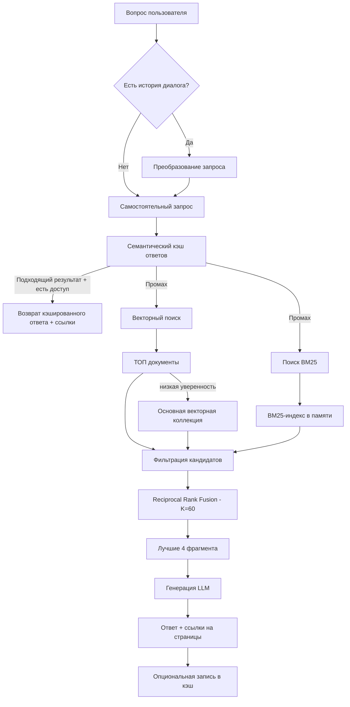

# Система поиска по университетским регламентам со ссылками на источники

Проект MSc Computer Science, исследующий, как **гибридный поиск, привязка ответов к источникам, преобразование контекстных запросов и контроль доступа на этапе поиска** могут улучшить ответы на вопросы по университетским регламентам.

Система разработана с использованием справочника School of Computer Science Университета Бирмингема как основного корпуса документов.

## Обзор

Универсальные LLM способны формировать связные ответы, однако вопросы по внутренним правилам конкретной организации предъявляют дополнительные требования: ответы должны основываться на официальных документах; точные термины и сокращения должны надежно находиться; пользователь должен иметь возможность проверить ответ по странице источника; закрытые материалы должны отфильтровываться до передачи в LLM; последующие вопросы должны сохранять контекст; а кэшированные ответы не должны использоваться после изменения исходного документа.

Проект решает эти задачи с помощью **трехэтапной Hybrid RAG-архитектуры**, которая объединяет семантический кэш, векторный поиск, лексический поиск BM25, Reciprocal Rank Fusion (RRF), ролевое управление доступом (RBAC) и генерацию ответов со ссылками на источники.

## Основные возможности

- **Гибридный поиск** — объединяет векторный поиск и лексический поиск BM25.
- **Reciprocal Rank Fusion** — объединяет результаты двух типов поиска с использованием `K = 60`.
- **Ответы со ссылками на источники** — сохраняют имя исходного файла и номер страницы на этапах поиска и генерации.
- **RBAC на этапе поиска** — фильтрует фрагменты документов до того, как они попадут в контекст LLM.
- **Преобразование контекстных запросов** — преобразует зависимые от истории диалога вопросы в самостоятельные поисковые запросы.
- **Семантический кэш ответов** — повторно использует достаточно похожие предыдущие ответы с учетом прав доступа.
- **Инвалидация кэша** — удаляет кэшированные ответы при изменении или удалении связанных исходных документов.
- **ТОП документы** — часто цитируемые документы переносятся в уменьшенную векторную коллекцию для приоритетного поиска.
- **Фоновая обработка PDF** — используется `ThreadPoolExecutor`, чтобы длительная обработка документов не блокировала HTTP-запрос загрузки.
- **Административное управление базой знаний** — поддерживаются загрузка PDF, назначение уровня доступа, отслеживание статуса обработки и удаление документов.

## Архитектура



### Настройки поиска

| Параметр | Значение |
|---|---:|
| Размер фрагмента | 150 слов |
| Перекрытие фрагментов | 30 слов |
| Максимум кандидатов векторного поиска | 15 |
| Максимум кандидатов BM25 | 15 |
| Порог L2 для векторного поиска | `1.40` |
| Порог семантического кэша | `0.18` |
| Порог расстояния для горячего уровня | `0.85` |
| Порог переноса в горячий уровень | 5 ответов с цитированием |
| Константа RRF | `K = 60` |
| Финальный размер контекста | `top_k = 4` |

Эти значения являются настройками конкретного проекта и оставались неизменными во время экспериментов. Их не следует считать универсально оптимальными параметрами.

## Ролевое управление доступом

Каждый индексируемый фрагмент содержит уровень доступа. Поиск ограничивается в соответствии с ролью аутентифицированного пользователя **до** объединения кандидатов и генерации ответа.

| Роль | Разрешенные уровни доступа |
|---|---|
| Студент | Public |
| Преподаватель | Public, Internal |
| Администратор | Public, Internal, Restricted |

Тот же принцип применяется к кэшированным ответам: кэшированный ответ возвращается только в том случае, если пользователь имеет доступ к самому высокому уровню конфиденциальности среди процитированных источников.

## Стек технологий

| Компонент | Технология |
|---|---|
| Язык | Python 3.11 |
| Веб-фреймворк | Flask 3.0 |
| Аутентификация | Flask-Login, Flask-WTF |
| ORM / данные приложения | SQLAlchemy, SQLite |
| Векторный поиск | ChromaDB |
| Лексический поиск | `rank_bm25` / BM25Okapi |
| Извлечение текста из PDF | PyMuPDF |
| Векторные представления | `all-MiniLM-L6-v2` |
| Размерность вектора | 384 |
| Работа с LLM | Groq API |
| Генерация / преобразование запросов | `openai/gpt-oss-120b` |
| Оценка RAG | RAGAS |

## Структура проекта

```text
.
├── app/
│   ├── models.py
│   ├── routes/
│   ├── services/
│   │   └── document_service.py
│   ├── templates/
│   └── ...
├── tests/
│   ├── eval_project.py
│   ├── eval_ragas.py
│   ├── test_ablation.py
│   ├── test_multiturn.py
│   └── test_hot_tier.py
├── experiment/
├── chroma_db/
├── uploads/
├── app.db
├── config.py
├── requirements.txt
├── setup.py
└── README.md
```

Репозиторий также содержит входные и выходные данные экспериментов, а также вспомогательную документацию по проектированию системы.

## Установка

### 1. Клонировать репозиторий

```bash
git clone <repository-url>
cd <repository-folder>
```

### 2. Создать виртуальное окружение

```bash
python -m venv venv
```

Активировать в Windows:

```powershell
venv\Scripts\activate
```

В macOS/Linux:

```bash
source venv/bin/activate
```

### 3. Установить зависимости

```bash
pip install -r requirements.txt
```

### 4. Настроить переменные окружения

Создайте файл `.env` в корневой папке репозитория:

```env
SECRET_KEY=replace-with-a-strong-random-secret
GROQ_API_KEY=your-groq-api-key
```

`SECRET_KEY` используется Flask для защиты сессий и приложения. `GROQ_API_KEY` должен содержать действующий ключ Groq API.

**Не добавляйте `.env`, API-ключи, пароли и рабочие секреты в систему контроля версий.**

### 5. Инициализировать приложение

```bash
python setup.py
```

### 6. Запустить приложение

```bash
flask run
```

Откройте:

```text
http://127.0.0.1:5000
```

## Типичный процесс обработки запроса

1. Пользователь задает вопрос на естественном языке.
2. Если существует история диалога, система преобразует последующий вопрос в самостоятельный поисковый запрос.
3. Проверяется семантический кэш с учетом прав доступа.
4. При отсутствии подходящего кэшированного ответа выполняются векторный поиск и BM25 по разрешенному пользователю содержимому.
5. Результаты векторного поиска фильтруются по расстоянию, а каждый поисковый механизм предоставляет до 15 кандидатов.
6. RRF объединяет лексический и семантический рейтинги.
7. Лучшие четыре фрагмента передаются в LLM вместе с именем источника и номером страницы.
8. Пользователю возвращается ответ со ссылками на источники.
9. Успешный ответ может быть сохранен в кэше вместе с требуемым уровнем доступа.

## Оценка системы

### Сравнение методов поиска

На тестовом наборе из 35 вопросов сравнивались векторный поиск, BM25 и Hybrid RRF. Результат считался успешным только в том случае, если **и ожидаемый документ, и ожидаемая страница** присутствовали среди первых четырех результатов.

| Метод поиска | Hit Rate@4 | MRR@4 |
|---|---:|---:|
| Только векторный поиск | 94.3% (33/35) | 0.8524 |
| Только BM25 | 97.1% (34/35) | 0.8976 |
| **Hybrid RRF** | **100.0% (35/35)** | **0.9214** |

На использованном тестовом наборе Hybrid RRF показал лучший результат, хотя улучшение по сравнению с BM25 было умеренным, а как минимум один запрос продемонстрировал ухудшение позиции после объединения результатов.

### Оценка RAGAS

Отдельная сквозная оценка на 16 запросах показала следующие результаты:

| Метрика | Значение |
|---|---:|
| Context Recall | **0.9792** |
| Context Precision | **0.9427** |
| Faithfulness | **0.8861** |
| Answer Relevancy | **0.8745** |

Результаты показывают высокое покрытие поиска и в целом хорошую привязку ответов к найденному контексту на выбранном тестовом наборе. Они не являются доказательством аналогичной эффективности на других университетах или других наборах документов.

### Обычная LLM и Hybrid RAG

В сравнительном эксперименте на 33 вопросах использовалась одна и та же базовая модель — с институциональным поиском и без него. Hybrid RAG лучше предоставлял информацию, специфичную для университета, и позволял отслеживать источник ответа. Обычная LLM в некоторых случаях отказывалась отвечать или использовала общие знания о высшем образовании.

Измеренная задержка составила:

| Конфигурация | Средняя задержка |
|---|---:|
| Обычная LLM | ~3.40 с |
| Hybrid RAG | ~7.23 с |

В этом эксперименте Hybrid RAG работал примерно **в 2.12 раза медленнее** из-за дополнительных этапов поиска, фильтрации, объединения результатов и генерации ответа на основе найденного контекста.

## Запуск экспериментов

Репозиторий содержит скрипты для оценки поиска, RAGAS, многошаговых диалогов и горячего уровня документов.

```bash
python tests/test_ablation.py
python tests/eval_ragas.py
python tests/test_multiturn.py
python tests/test_hot_tier.py
```

Сравнение обычной LLM и Hybrid RAG реализовано в экспериментальном процессе внутри репозитория. Точные команды могут зависеть от окончательной структуры проекта и настроек окружения.

## Согласованность кэша

Семантический кэш связан с исходными документами. Если индексируемый документ изменяется или удаляется, связанные с ним кэшированные ответы удаляются. Это снижает риск возврата ответов, основанных на устаревших правилах.

Повторное использование кэша также ограничено RBAC: одной семантической близости недостаточно, если у пользователя нет необходимого уровня доступа к источникам кэшированного ответа.

## Ограничения

- Относительно небольшие наборы данных для оценки.
- Фиксированные значения RRF, порогов и количества кандидатов.
- Не проводился систематический подбор гиперпараметров.
- При извлечении сложных таблиц или многостолбцовых PDF возможна потеря информации.
- BM25-индекс хранится в памяти локального приложения.
- Семантический кэш и горячий уровень требуют согласованности состояния.
- Качество системы зависит от актуальности и корректности исходных документов.
- Использование внешнего LLM API увеличивает задержку.
- Галлюцинации и фактическая корректность не оценивались как полностью независимый набор утверждений на уровне отдельных фактов.
- Горячий уровень и преобразование контекстных запросов не оценивались отдельно с точки зрения влияния на производительность.

## Дальнейшее развитие

Возможные направления развития включают адаптивное или обучаемое объединение результатов поиска, reranking с использованием cross-encoder, обработку PDF с учетом структуры документа или мультимодальных данных, более крупные независимо размеченные тестовые наборы, количественную оценку фактической корректности на уровне отдельных утверждений, распределенный лексический поиск, более надежное версионирование документов, автоматическую переиндексацию и обеспечение согласованности кэша и индексов на уровне промышленной эксплуатации.

## Научное позиционирование

Проект **не предлагает новый алгоритм поиска**. Его вклад заключается в интеграции и оценке известных методов поиска и программной инженерии для ответов на вопросы по нормативным документам конкретной организации: гибридный векторный и лексический поиск, объединение результатов через RRF, контроль доступа на этапе поиска, ссылки на источник и страницу, семантический кэш с инвалидацией, преобразование контекстных запросов и фоновая обработка документов.

Представленные результаты следует интерпретировать как данные, полученные для корпуса нормативных документов School of Computer Science Университета Бирмингема и использованной конфигурации тестирования.