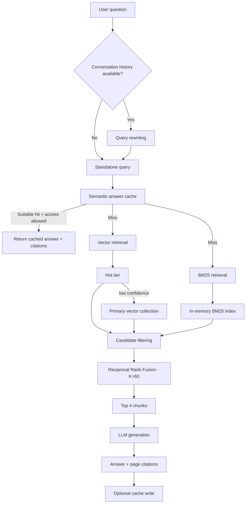

# Citation-Grounded University Regulations Assistant

An MSc Computer Science project investigating how **hybrid retrieval, citation-grounded answers, contextual query rewriting, and retrieval-time access control** can improve question answering over university regulations.

The system was developed using the University of Birmingham School of Computer Science handbook as the primary document corpus.

## Overview

General-purpose LLMs can produce fluent answers, but questions about organisation-specific regulations introduce additional requirements: answers should be grounded in official documents; exact terminology and abbreviations should be retrieved reliably; users should be able to verify answers against source pages; restricted content should be filtered before it reaches the LLM; follow-up questions should preserve conversational context; and cached answers should not be reused after the underlying source document changes.

This project addresses these challenges through a **three-stage Hybrid RAG architecture** combining semantic caching, vector retrieval, BM25 lexical retrieval, Reciprocal Rank Fusion (RRF), role-based access control (RBAC), and citation-grounded answer generation.

## Key Features

- **Hybrid retrieval** — combines vector retrieval with BM25 lexical retrieval.
- **Reciprocal Rank Fusion** — merges rankings from both retrieval methods using `K = 60`.
- **Citation-grounded answers** — preserve the source filename and page number through retrieval and generation.
- **Retrieval-time RBAC** — filters document chunks before they are included in the LLM context.
- **Contextual query rewriting** — converts dialogue-dependent follow-up questions into standalone retrieval queries.
- **Semantic answer cache** — reuses sufficiently similar previous answers while respecting access permissions.
- **Cache invalidation** — removes cached answers when related source documents are modified or deleted.
- **Hot documents** — frequently cited documents are promoted to a smaller vector collection for priority retrieval.
- **Background PDF processing** — uses `ThreadPoolExecutor` so long-running document processing does not block the HTTP upload request.
- **Administrative knowledge-base management** — supports PDF upload, access-level assignment, processing-status tracking, and document deletion.

## Architecture


```mermaid
flowchart TD
    A[User question] --> B{Conversation history available?}
    B -- Yes --> C[Query rewriting]
    B -- No --> D[Standalone query]
    C --> D
    D --> E[Semantic answer cache]
    E -- Suitable hit + access allowed --> Z[Return cached answer + citations]
    E -- Miss --> F1[Vector retrieval]
    E -- Miss --> F2[BM25 retrieval]
    F1 --> G1[Hot tier]
    G1 -->|low confidence| G2[Primary vector collection]
    F2 --> H[In-memory BM25 index]
    G1 --> I[Candidate filtering]
    G2 --> I
    H --> I
    I --> J[Reciprocal Rank Fusion - K=60]
    J --> K[Top 4 chunks]
    K --> L[LLM generation]
    L --> M[Answer + page citations]
    M --> N[Optional cache write]
```

### Retrieval Settings

| Parameter | Value |
|---|---:|
| Chunk size | 150 words |
| Chunk overlap | 30 words |
| Maximum vector candidates | 15 |
| Maximum BM25 candidates | 15 |
| Vector retrieval L2 threshold | `1.40` |
| Semantic cache threshold | `0.18` |
| Hot-tier distance threshold | `0.85` |
| Hot-tier promotion threshold | 5 answers with citations |
| RRF constant | `K = 60` |
| Final context size | `top_k = 4` |

These values are specific project settings and remained fixed during the experiments. They should not be interpreted as universally optimal parameters.

## Role-Based Access Control

Each indexed chunk contains an access level. Retrieval is restricted according to the authenticated user's role **before** candidate fusion and answer generation.

| Role | Allowed access levels |
|---|---|
| Student | Public |
| Staff | Public, Internal |
| Administrator | Public, Internal, Restricted |

The same principle is applied to cached answers: a cached response is returned only when the user has access to the highest confidentiality level among the cited sources.

## Technology Stack

| Component | Technology |
|---|---|
| Language | Python 3.11 |
| Web framework | Flask 3.0 |
| Authentication | Flask-Login, Flask-WTF |
| ORM / application data | SQLAlchemy, SQLite |
| Vector retrieval | ChromaDB |
| Lexical retrieval | `rank_bm25` / BM25Okapi |
| PDF text extraction | PyMuPDF |
| Embeddings | `all-MiniLM-L6-v2` |
| Embedding dimension | 384 |
| LLM integration | Groq API |
| Generation / query rewriting | `openai/gpt-oss-120b` |
| RAG evaluation | RAGAS |

## Project Structure

```text
.
├── app/
│   ├── models.py
│   ├── routes/
│   ├── services/
│   │   └── document_service.py
│   ├── templates/
│   └── ...
├── tests/
│   ├── eval_project.py
│   ├── eval_ragas.py
│   ├── test_ablation.py
│   ├── test_multiturn.py
│   └── test_hot_tier.py
├── experiment/
├── chroma_db/
├── uploads/
├── app.db
├── config.py
├── requirements.txt
├── setup.py
└── README.md
```

The repository also contains experiment inputs and outputs, as well as supporting documentation describing the system design.

## Installation

### 1. Clone the repository

```bash
git clone <repository-url>
cd <repository-folder>
```

### 2. Create a virtual environment

```bash
python -m venv venv
```

Activate it on Windows:

```powershell
venv\Scripts\activate
```

On macOS/Linux:

```bash
source venv/bin/activate
```

### 3. Install dependencies

```bash
pip install -r requirements.txt
```

### 4. Configure environment variables

Create a `.env` file in the repository root:

```env
SECRET_KEY=replace-with-a-strong-random-secret
GROQ_API_KEY=your-groq-api-key
```

`SECRET_KEY` is used by Flask to protect sessions and application security. `GROQ_API_KEY` must contain a valid Groq API key.

**Do not commit `.env`, API keys, passwords, or production secrets to version control.**

### 5. Initialise the application

```bash
python setup.py
```

### 6. Run the application

```bash
flask run
```

Open:

```text
http://127.0.0.1:5000
```

## Typical Request Processing Flow

1. The user asks a question in natural language.
2. If conversation history exists, the system rewrites the follow-up question into a standalone retrieval query.
3. The semantic cache is checked with access control applied.
4. If no suitable cached answer exists, vector retrieval and BM25 retrieval are performed over content the user is authorised to access.
5. Vector results are filtered by distance, and each retrieval method contributes up to 15 candidates.
6. RRF combines the lexical and semantic rankings.
7. The top four chunks are passed to the LLM together with the source filename and page number.
8. The user receives an answer with source citations.
9. A successful answer may be stored in the cache together with its required access level.

## System Evaluation

### Retrieval Method Comparison

A test set of 35 questions was used to compare vector retrieval, BM25, and Hybrid RRF. A result was counted as successful only when **both the expected document and the expected page** appeared within the top four retrieved results.

| Retrieval method | Hit Rate@4 | MRR@4 |
|---|---:|---:|
| Vector only | 94.3% (33/35) | 0.8524 |
| BM25 only | 97.1% (34/35) | 0.8976 |
| **Hybrid RRF** | **100.0% (35/35)** | **0.9214** |

On the evaluated dataset, Hybrid RRF achieved the strongest result, although the improvement over BM25 was moderate, and at least one query showed a lower ranking after result fusion.

### RAGAS Evaluation

A separate end-to-end evaluation on 16 queries produced the following results:

| Metric | Value |
|---|---:|
| Context Recall | **0.9792** |
| Context Precision | **0.9427** |
| Faithfulness | **0.8861** |
| Answer Relevancy | **0.8745** |

These results indicate high retrieval coverage and generally strong grounding of answers in the retrieved context on the selected test set. They do not demonstrate equivalent performance across other universities or document collections.

### Plain LLM vs Hybrid RAG

A comparative experiment on 33 questions used the same base model with and without institutional retrieval. Hybrid RAG was better able to provide university-specific information and allowed the source of each answer to be traced. The plain LLM sometimes refused to answer or relied on general knowledge about higher education.

Measured latency was:

| Configuration | Average latency |
|---|---:|
| Plain LLM | ~3.40 s |
| Hybrid RAG | ~7.23 s |

In this experiment, Hybrid RAG was approximately **2.12× slower** because of the additional retrieval, filtering, result-fusion, and context-grounded generation stages.

## Running the Experiments

The repository contains scripts for retrieval evaluation, RAGAS evaluation, multi-turn dialogue testing, and hot-tier testing.

```bash
python tests/test_ablation.py
python tests/eval_ragas.py
python tests/test_multiturn.py
python tests/test_hot_tier.py
```

The plain-LLM-versus-Hybrid-RAG comparison is implemented in the repository's experimental workflow. Exact commands may depend on the final project structure and environment configuration.

## Cache Consistency

The semantic cache is linked to source documents. If an indexed document is modified or deleted, cached answers associated with that document are removed. This reduces the risk of returning answers grounded in outdated regulations.

Cache reuse is also restricted by RBAC: semantic similarity alone is insufficient when the user does not have the required level of access to the sources referenced by the cached answer.

## Limitations

- Relatively small evaluation datasets.
- Fixed RRF, threshold, and candidate-count settings.
- No systematic hyperparameter optimisation was performed.
- Complex tables or multi-column PDFs may lose information during extraction.
- The BM25 index is stored in local application memory.
- The semantic cache and hot tier require state consistency.
- System quality depends on the correctness and freshness of the source documents.
- Use of an external LLM API increases latency.
- Hallucination and factual correctness were not evaluated as a fully independent set of claim-level factual checks.
- The hot tier and contextual query rewriting were not evaluated independently for their effect on system performance.

## Future Work

Possible extensions include adaptive or learnable retrieval fusion, cross-encoder reranking, document-structure-aware or multimodal PDF processing, larger independently labelled evaluation datasets, quantitative claim-level factual correctness evaluation, distributed lexical retrieval, more robust document versioning, automatic re-indexing, and production-grade consistency management across the cache and indexes.

## Research Positioning

This project **does not propose a new retrieval algorithm**. Its contribution lies in integrating and evaluating established retrieval and software-engineering techniques for question answering over organisation-specific regulatory documents: hybrid vector and lexical retrieval, RRF-based result fusion, retrieval-time access control, source-and-page citations, semantic caching with invalidation, contextual query rewriting, and background document processing.

The reported results should be interpreted as evidence from the University of Birmingham School of Computer Science regulations corpus and the specific experimental configuration used in this project.
